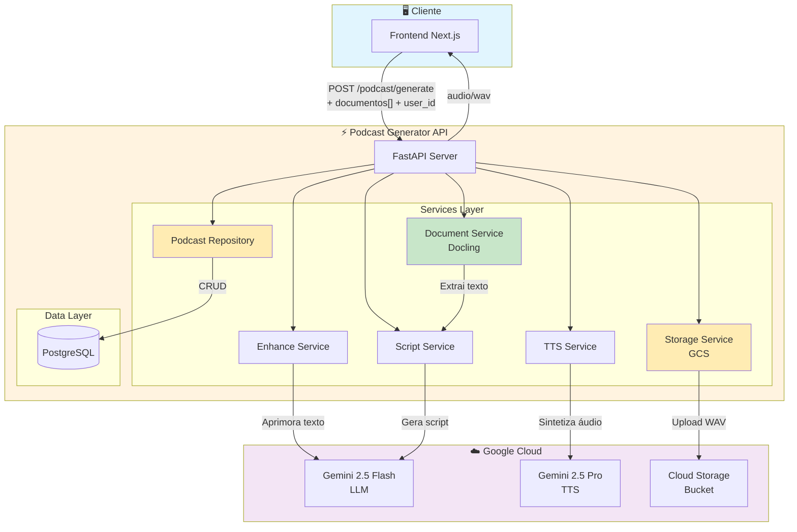
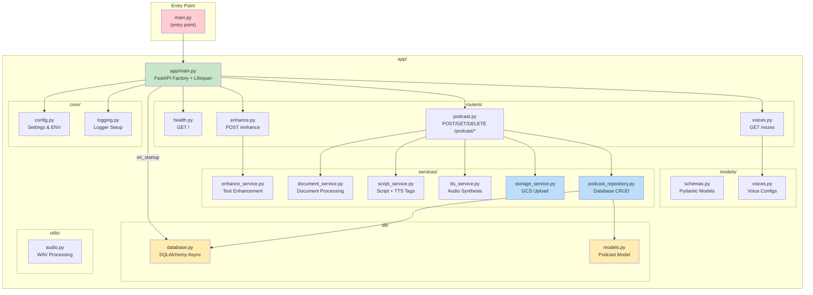
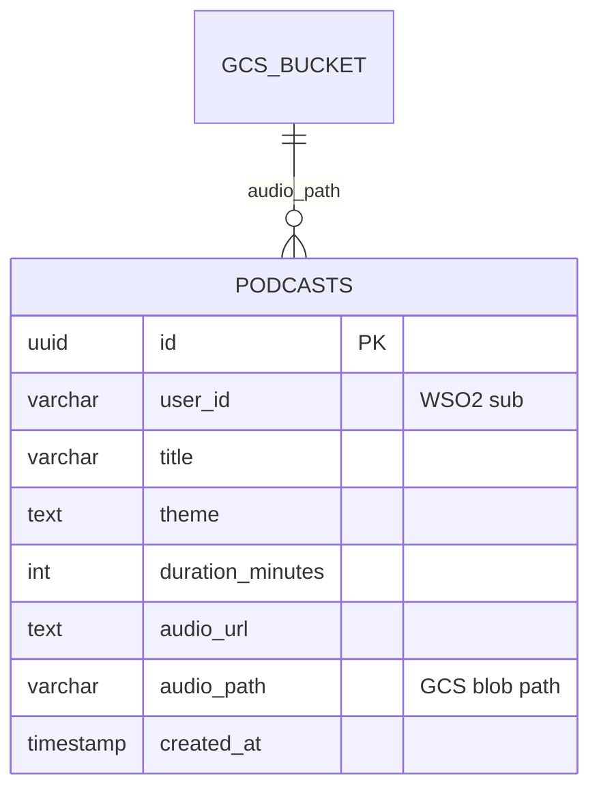
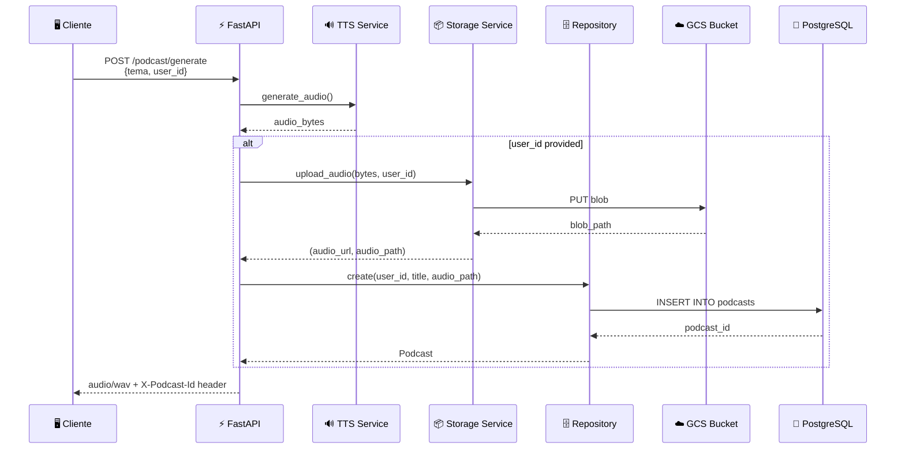
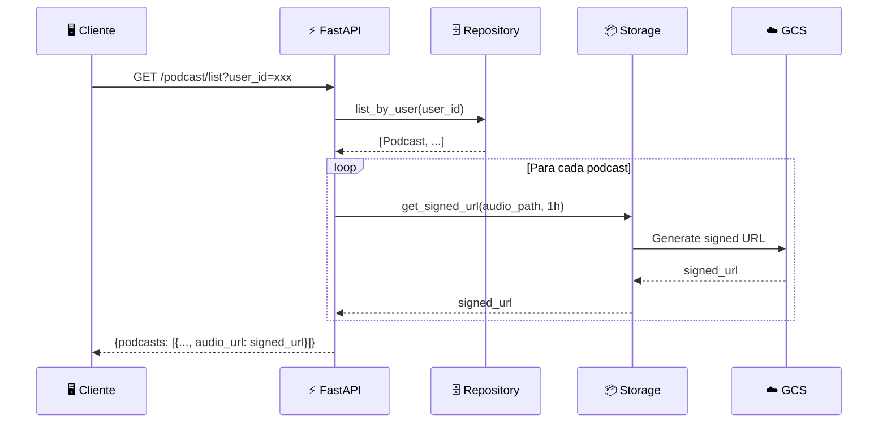
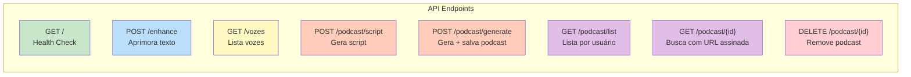
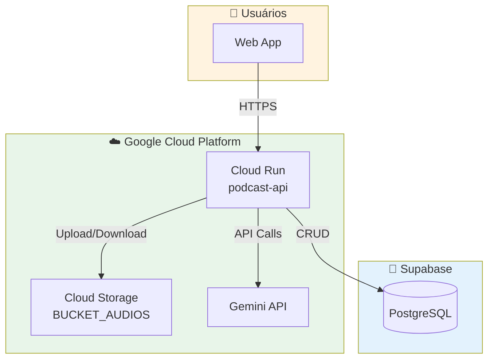

# 🎙️ Podcast Generator API

API de alta performance para geração de podcasts usando **Gemini 2.5 Flash** (roteirização) + **Gemini 2.5 Pro TTS** (síntese de voz multi-speaker), com persistência em **GCP Cloud Storage** e **PostgreSQL**.


---

## 📖 Índice

- [Visão Geral](#-visão-geral)
- [Arquitetura de Alto Nível](#-arquitetura-de-alto-nível)
- [Arquitetura Modular](#-arquitetura-modular)
- [Camada de Persistência](#-camada-de-persistência)
- [Fluxo de Dados](#-fluxo-de-dados)
- [Tags TTS para Scripts](#-tags-tts-para-scripts)
- [API Endpoints](#-api-endpoints)
- [Estrutura do Projeto](#-estrutura-do-projeto)
- [Instalação e Uso](#-instalação-e-uso)
- [Deploy em Produção](#-deploy-em-produção)

---

## 🎯 Visão Geral

O **Podcast Generator API** transforma temas em podcasts de áudio realistas e envolventes. A solução utiliza:

| Componente | Tecnologia | Função |
|------------|------------|--------|
| **Backend** | FastAPI + Python 3.12 | API REST assíncrona de alta performance |
| **Roteirização** | Gemini 2.5 Flash | Geração de scripts com TTS markup tags |
| **Síntese de Voz** | Gemini 2.5 Pro TTS | Multi-speaker com 30+ vozes disponíveis |
| **Processamento de Docs** | Docling (IBM) | Extração de texto de PDF, DOCX, XLSX, PPTX, TXT |
| **Armazenamento** | GCP Cloud Storage | Áudio persistido com URLs assinadas |
| **Banco de Dados** | PostgreSQL (Supabase) | Metadados de podcasts por usuário |
| **Containerização** | Docker | Deploy portável e escalável (CPU-only) |

### Features

- ✅ **Multi-host**: Suporta 2 apresentadores (limitação da API TTS)
- ✅ **30 vozes**: Femininas e masculinas com personalidades distintas
- ✅ **Upload de documentos**: PDF, DOCX, XLSX, PPTX, TXT (até 20 arquivos)
- ✅ **Extração inteligente**: Docling com OCR, tabelas e layout avançado
- ✅ **TTS Markup Tags**: `[sigh]`, `[laughing]`, `[pause]` para áudio natural
- ✅ **Persistência**: Salva podcasts no GCP Storage + metadados no PostgreSQL
- ✅ **Histórico por usuário**: Lista, reproduz e deleta podcasts anteriores
- ✅ **URLs assinadas**: Acesso seguro a arquivos privados

---

## 🏗️ Arquitetura de Alto Nível



---

## 🧩 Arquitetura Modular

O projeto segue uma arquitetura **modular e desacoplada** com separação clara de responsabilidades:



---

## 💾 Camada de Persistência

### Arquitetura de Dados



### Fluxo de Persistência



### URLs Assinadas

Como o bucket é **privado**, usamos URLs assinadas para acesso:



---

## 🎤 Tags TTS para Scripts

O gerador de scripts inclui instruções para usar **markup tags** que enriquecem a síntese de voz:

### Sons Não-Verbais

| Tag | Descrição | Exemplo |
|-----|-----------|---------|
| `[sigh]` | Insere suspiro | `[sigh] Isso é complicado...` |
| `[laughing]` | Insere risada | `[laughing] Essa foi boa!` |
| `[uhm]` | Hesitação natural | `Então, [uhm] deixa eu pensar...` |

### Modificadores de Estilo

| Tag | Descrição | Exemplo |
|-----|-----------|---------|
| `[sarcasm]` | Tom sarcástico | `[sarcasm] Que surpresa...` |
| `[whispering]` | Sussurro | `[whispering] Isso é segredo.` |
| `[shouting]` | Volume alto | `[shouting] Incrível!` |
| `[extremely fast]` | Fala acelerada | `[extremely fast] Termos e condições...` |

### Pausas e Ritmo

| Tag | Duração | Uso |
|-----|---------|-----|
| `[short pause]` | ~250ms | Entre cláusulas |
| `[medium pause]` | ~500ms | Entre frases |
| `[long pause]` | ~1000ms | Efeito dramático |

### Exemplo de Script Gerado

```
Speaker 1: Olá pessoal! [short pause] Bem-vindos a mais um episódio.
Speaker 2: Hoje vamos falar sobre [uhm] um tema que todo mundo quer saber...
Speaker 1: [laughing] É verdade! [medium pause] Então vamos direto ao ponto.
Speaker 2: [sigh] Olha, esse assunto é complexo, mas vou explicar de forma simples.
```

---

## 🔌 API Endpoints

### Visão Geral



### Tabela de Endpoints

| Método | Endpoint | Descrição | Autenticação |
|--------|----------|-----------|--------------|
| `GET` | `/` | Health check | Não |
| `POST` | `/enhance` | Aprimora texto com IA | Não |
| `GET` | `/vozes` | Lista vozes disponíveis | Não |
| `POST` | `/podcast/script` | Gera apenas o script | Não |
| `POST` | `/podcast/generate` | Gera podcast + salva se `user_id` | user_id (opcional) |
| `GET` | `/podcast/list` | Lista podcasts do usuário | user_id (query) |
| `GET` | `/podcast/{id}` | Retorna podcast específico | user_id (query) |
| `DELETE` | `/podcast/{id}` | Deleta podcast | user_id (query) |

### Exemplos de Uso

```bash
# Gerar podcast e salvar
curl -X POST http://localhost:8000/podcast/generate \
  -F "tema=Inteligência Artificial na Indústria 4.0" \
  -F "duracao_minutos=3" \
  -F "num_hosts=2" \
  -F "user_id=user123" \
  -F 'hosts_vozes=[{"hostNumber":1,"vozId":"Zephyr"},{"hostNumber":2,"vozId":"Puck"}]' \
  --output podcast.wav

# Listar podcasts do usuário
curl "http://localhost:8000/podcast/list?user_id=user123" | jq

# Deletar podcast
curl -X DELETE "http://localhost:8000/podcast/abc123?user_id=user123"
```

---

## 📁 Estrutura do Projeto

```
podcast-api-tts/
├── main.py                         # Entry point
├── Dockerfile                      # Container config
├── pyproject.toml                  # Dependencies (uv)
├── .env                            # Environment variables
│
├── app/
│   ├── __init__.py
│   ├── main.py                     # FastAPI app factory + lifespan
│   │
│   ├── core/
│   │   ├── config.py               # Settings & environment
│   │   └── logging.py              # Logging configuration
│   │
│   ├── db/                         # 🆕 Database layer
│   │   ├── database.py             # SQLAlchemy async engine
│   │   └── models.py               # Podcast model
│   │
│   ├── models/
│   │   ├── schemas.py              # Pydantic request/response
│   │   └── voices.py               # TTS voice configurations
│   │
│   ├── services/
│   │   ├── document_service.py     # Document extraction (Docling)
│   │   ├── enhance_service.py      # Text enhancement (LLM)
│   │   ├── script_service.py       # Script generation + TTS tags
│   │   ├── tts_service.py          # Audio synthesis (TTS)
│   │   ├── storage_service.py      # 🆕 GCS upload + signed URLs
│   │   └── podcast_repository.py   # 🆕 Database CRUD
│   │
│   ├── utils/
│   │   └── audio.py                # WAV encoding utilities
│   │
│   └── routers/
│       ├── health.py               # GET /
│       ├── enhance.py              # POST /enhance
│       ├── podcast.py              # POST/GET/DELETE /podcast/*
│       └── voices.py               # GET /vozes
│
└── scripts/
    ├── install_docling.sh          # Install PyTorch CPU + Docling
    └── download_models.py          # Pre-cache Docling models
```

---

## 🛠️ Instalação e Uso

### Pré-requisitos

- **Python 3.12+**
- **uv** (recomendado) ou **pip**
- **API Key do Google Gemini**
- **Bucket GCS** (para persistência)
- **PostgreSQL** (Supabase ou outro)

### Variáveis de Ambiente

```env
# Gemini API
GEMINI_API_KEY=sua_chave_aqui

# GCP Storage
BUCKET_AUDIOS=nome-do-bucket

# PostgreSQL (Supabase)
DB_HOST=aws-0-us-west-2.pooler.supabase.com
DB_PORT=6543
DB_NAME=podcast
DB_USER=postgres.xxxx
DB_PASSWORD=xxx
DB_SSLMODE=require
```

### Instalação Local

```bash
# 1. Clone o repositório
git clone <repo-url>
cd podcast-api-tts

# 2. Configure as variáveis de ambiente
cp .env.example .env
# Edite o .env com suas credenciais

# 3. Instale as dependências
uv sync

# 4. Execute o servidor
uv run python -m uvicorn app.main:app --host 0.0.0.0 --port 8000 --reload
```

### Executando com Docker

```bash
# Build da imagem
docker build -t podcast-api .

# Run do container
docker run -p 8000:8000 --env-file .env podcast-api
```

---

## ☁️ Deploy em Produção

### Google Cloud Run

```bash
gcloud run deploy podcast-api \
  --source . \
  --region us-central1 \
  --allow-unauthenticated \
  --set-env-vars="GEMINI_API_KEY=xxx,BUCKET_AUDIOS=xxx,DB_HOST=xxx,..."
```

### Arquitetura de Deploy



---

## 🎤 Vozes Disponíveis

O sistema suporta **30 vozes** do Gemini TTS (limitado a 2 por podcast):

| Femininas | Masculinas |
|-----------|------------|
| Achernar, Aoede, Autonoe | Achird, Algenib, Algieba |
| Callirrhoe, Despina, Erinome | Alnilam, Charon, Enceladus |
| Gacrux, Kore, Laomedeia | Fenrir, Iapetus, Orus |
| Leda, Pulcherrima, Sulafat | Puck, Rasalgethi, Sadachbia |
| Vindemiatrix, Zephyr | Sadaltager, Schedar, Umbriel, Zubenelgenubi |

---

## 📄 Licença

MIT License - veja [LICENSE](LICENSE) para detalhes.
