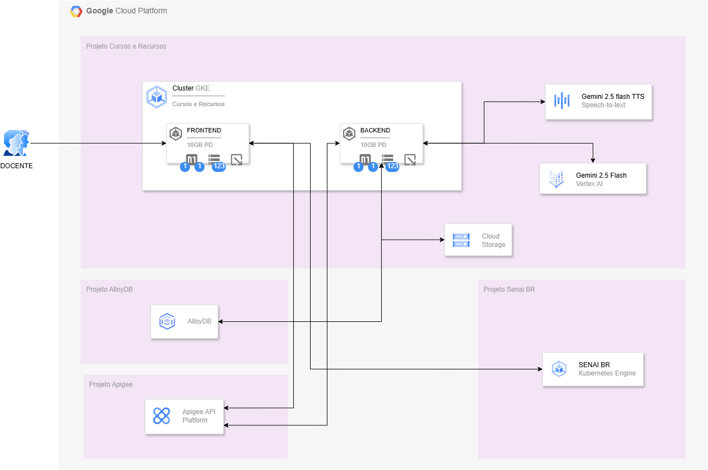
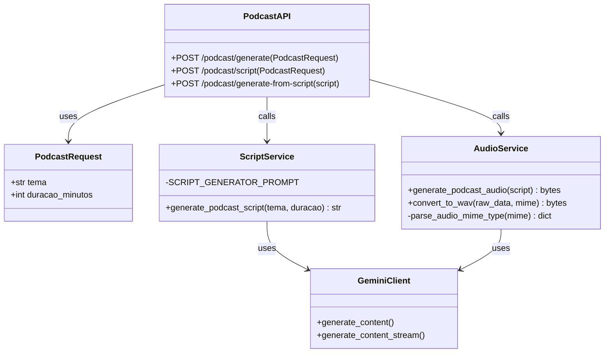

# Podcast API TTS (Generator)

Este projeto é uma **API de Geração de Podcasts** de alta performance, projetada para transformar temas e tópicos em podcasts de áudio realistas e envolventes. Utilizando o estado da arte em **Inteligência Artificial Generativa**, a solução combina a capacidade de roteirização criativa do **Gemini 2.5 Flash** com a expressividade vocal do **Gemini 2.5 Pro TTS (Text-to-Speech)**.

---

## 🏗️ Arquitetura do Projeto

A solução foi arquitetada seguindo o padrão de **Microsserviços**, encapsulada em container Docker para garantir portabilidade e escalabilidade. O backend é construído em **Python** utilizando o framework **FastAPI**, conhecido por sua altíssima performance (baseada em Starlette e Pydantic) e suporte nativo a operações assíncronas.

### Visão Geral da Arquitetura

O fluxo de dados segue uma abordagem linear de pipelines:
1.  **Input**: O cliente envia um tema e duração desejada.
2.  **Scripting Pipeline**: A API orquestra uma chamada ao LLM (Gemini 2.5 Flash) com engenharia de prompt avançada para gerar um roteiro de podcast natural, simulando dois apresentadores (Speaker 1 e Speaker 2).
3.  **Audio Synthesis Pipeline**: O roteiro gerado é processado pelo motor de TTS (Gemini 2.5 Pro), que sintetiza vozes distintas para cada speaker ("Zephyr" e "Puck") e gera o áudio final.
4.  **Output**: O áudio sintetizado é convertido para o container WAV e streamado de volta ao cliente.

### Diagrama de Arquitetura (High-Level)

Abaixo uma representação da arquitetura baseada no diagrama original do projeto.



> 📐 **Diagrama Fonte**: O diagrama original editável está disponível em: [diagrams/arquitetura.drawio](diagrams/arquitetura.drawio). Recomenda-se usar o [diagrams.net](https://app.diagrams.net/) para visualização e edição completa.

---

## 🧩 Arquitetura de Software e Componentes

O projeto adota uma estrutura limpa e modular com foco em **Separação de Preocupações (SoC)**.

### Estrutura de Pastas e Arquivos

*   **`main.py`**: O coração da aplicação. Contém:
    *   **Models (Pydantic)**: Definição estrita dos contratos de dados (`PodcastRequest`, `PodcastScriptResponse`).
    *   **Services**: Funções isoladas para interação com APIs externas (`generate_podcast_script`, `generate_podcast_audio`).
    *   **Utils**: Utilitários de baixo nível para manipulação de bytes de áudio (`convert_to_wav`, `parse_audio_mime_type`).
    *   **Controllers/Routes**: Endpoints da API.
*   **`Dockerfile`**: Definição do ambiente de execução, otimizado com imagem base `python:3.12-slim-bookworm` e dependências de sistema para processamento de áudio (`portaudio19-dev`).
*   **`requirements.txt`**: Gerenciamento de dependências Python.

### Diagrama de Classes e Componentes



---

## 🚀 Fluxo de Funcionamento Detalhado

### 1. Geração de Script (Scripting Engine)
O processo começa com a função `generate_podcast_script`.
*   O sistema carrega um **System Prompt** especializado, instruindo o modelo a agir como um roteirista de podcast brasileiro.
*   **Prompt Engineering**: O prompt impõe regras estritas de formatação ("Speaker 1:", "Speaker 2:") para garantir que o parser de TTS consiga identificar as trocas de turno.
*   **Modelo**: Utiliza `gemini-2.5-flash` por sua baixa latência e alta capacidade de contexto.

### 2. Síntese de Áudio (TTS Engine)
A função `generate_podcast_audio` processa o texto.
*   **Multi-Speaker Configuration**: Configura o `MultiSpeakerVoiceConfig` do Gemini API.
    *   **Speaker 1**: Voz "Zephyr" (Tom mais grave/sério ou balanceado).
    *   **Speaker 2**: Voz "Puck" (Tom mais dinâmico/energético).
*   **Streaming & Buffering**: A resposta do TTS é recebida em streams (chunks). O código coleta esses chunks, identifica o MIME type, decodifica o áudio raw e reagrupa tudo.
*   **WAV Encoding**: Como o áudio pode vir em formatos raw (PCM), a função `convert_to_wav` adiciona o cabeçalho RIFF/WAVE canônico (44.1kHz ou 24kHz, 16-bit PCM) para garantir compatibilidade com qualquer player.

---

## 🛠️ Guia de Instalação e Uso

### Pré-requisitos
*   **Docker** instalado.
*   **API Key do Google Gemini** configurada.

### Rodando Localmente (Docker)

1.  **Clone o repositório** e entre na pasta:
    ```bash
    cd podcast-api-tts
    ```

2.  **Crie o arquivo `.env`**:
    ```bash
    echo "GEMINI_API_KEY=sua_chave_aqui" > .env
    ```

3.  **Build e Run**:
    ```bash
    docker build -t podcast-api .
    docker run -p 8080:8080 --env-file .env podcast-api
    ```

### Endpoints Principais

| Método | Endpoint | Descrição |
| :--- | :--- | :--- |
| `POST` | `/podcast/generate` | Gera o áudio final diretamente do tema. Payload: `{"tema": "IA no futuro", "duracao_minutos": 3}` |
| `POST` | `/podcast/script` | Gera apenas o texto do roteiro. Útil para validar o conteúdo antes de gastar cota de TTS. |

---

## ☁️ Deploy em Produção (Google Cloud Run)

Este projeto é "Cloud Run Ready". O `Dockerfile` já configura a variável `PORT` corretamente.
Para deploy:
```bash
gcloud run deploy podcast-api --source . --region us-central1 --allow-unauthenticated
```
Lembre-se de configurar a variável de ambiente `GEMINI_API_KEY` no painel do Cloud Run.
