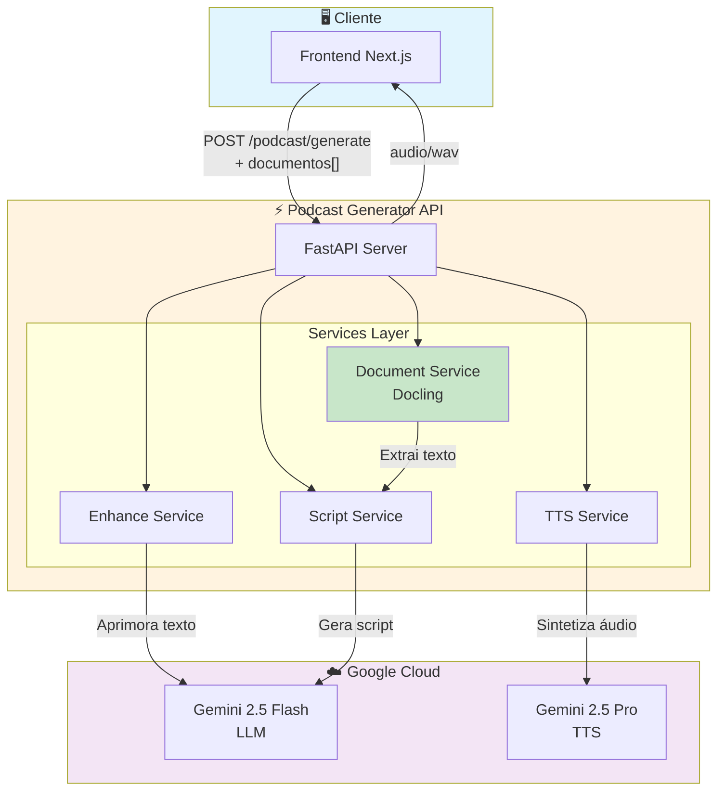
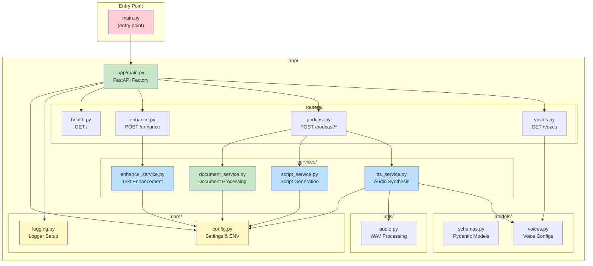
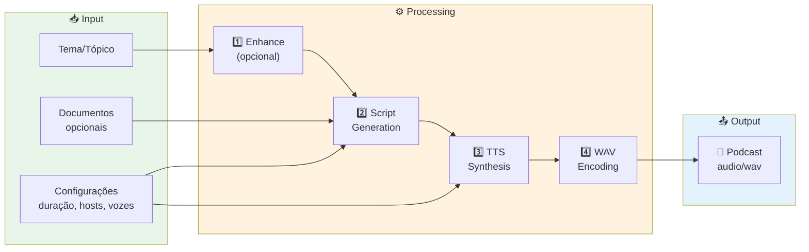
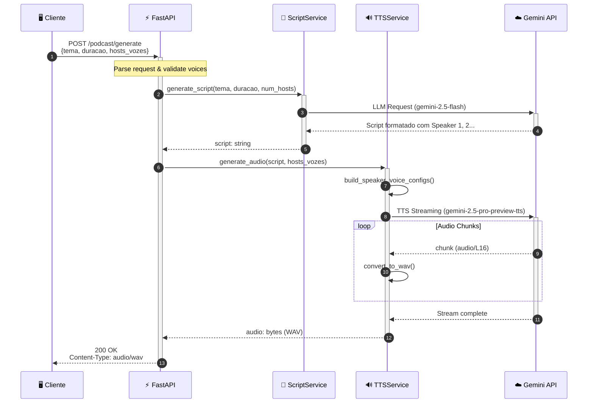
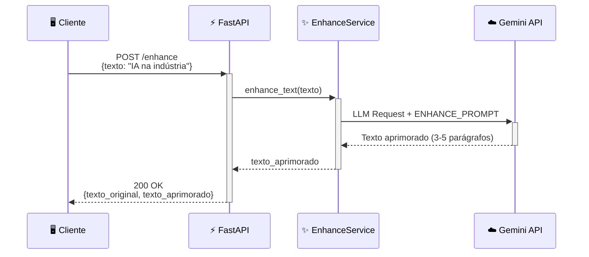
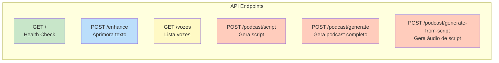
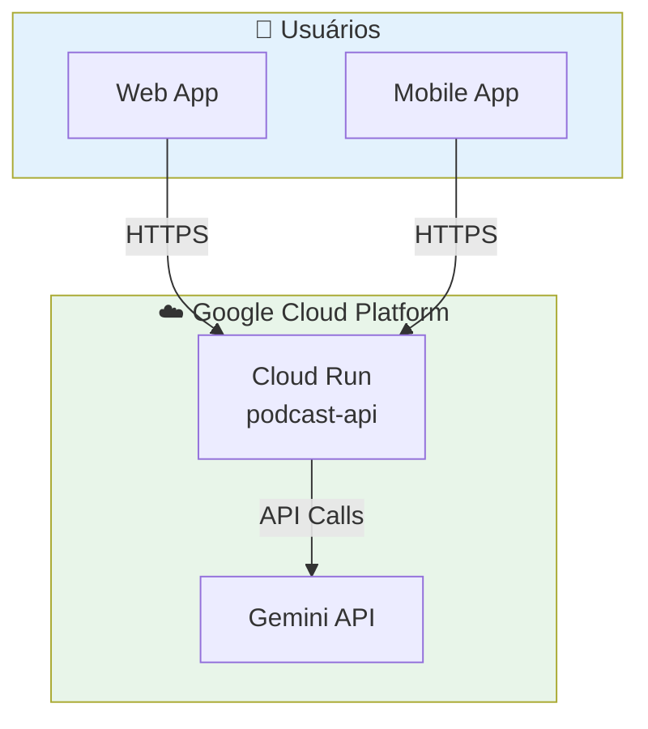
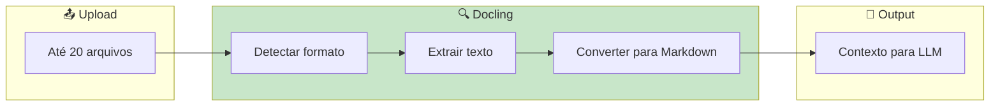

# 🎙️ Podcast Generator API

API de alta performance para geração de podcasts usando **Gemini 2.5 Flash** (roteirização) + **Gemini 2.5 Pro TTS** (síntese de voz multi-speaker).


---

## 📖 Índice

- [Visão Geral](#-visão-geral)
- [Arquitetura de Alto Nível](#-arquitetura-de-alto-nível)
- [Arquitetura Modular](#-arquitetura-modular)
- [Fluxo de Dados](#-fluxo-de-dados)
- [Diagrama de Sequência](#-diagrama-de-sequência)
- [API Endpoints](#-api-endpoints)
- [Estrutura do Projeto](#-estrutura-do-projeto)
- [Instalação e Uso](#-instalação-e-uso)
- [Deploy em Produção](#-deploy-em-produção)

---

## 🎯 Visão Geral

O **Podcast Generator API** transforma temas em podcasts de áudio realistas e envolventes. A solução utiliza:

| Componente | Tecnologia | Função |
|------------|------------|--------|
| **Backend** | FastAPI + Python 3.12 | API REST assíncrona de alta performance |
| **Roteirização** | Gemini 2.5 Flash | Geração de scripts com engenharia de prompt |
| **Síntese de Voz** | Gemini 2.5 Pro TTS | Multi-speaker com 30+ vozes disponíveis |
| **Processamento de Docs** | Docling (IBM) | Extração de texto de PDF, DOCX, XLSX, PPTX, TXT |
| **Containerização** | Docker | Deploy portável e escalável (CPU-only) |

### Features

- ✅ **Multi-host**: Suporta de 1 a 10 apresentadores
- ✅ **30 vozes**: Femininas e masculinas com personalidades distintas
- ✅ **Upload de documentos**: PDF, DOCX, XLSX, PPTX, TXT (até 20 arquivos)
- ✅ **Extração inteligente**: Docling com OCR, tabelas e layout avançado
- ✅ **Aprimoramento de texto**: IA expande ideias simples em descrições ricas
- ✅ **Preview de script**: Valide o roteiro antes de gerar o áudio
- ✅ **Output WAV**: Áudio de alta qualidade (24kHz, 16-bit PCM)

---

## 🏗️ Arquitetura de Alto Nível



---

## 🧩 Arquitetura Modular

O projeto segue uma arquitetura **modular e desacoplada** com separação clara de responsabilidades:



### Benefícios da Arquitetura

| Aspecto | Benefício |
|---------|-----------|
| **Testabilidade** | Cada service pode ser testado isoladamente |
| **Manutenção** | Arquivos pequenos (~50-100 linhas) fáceis de navegar |
| **Escalabilidade** | Fácil adicionar novos serviços ou endpoints |
| **Reutilização** | Services podem ser usados em outros projetos |
| **Onboarding** | Estrutura clara para novos desenvolvedores |

---

## 🔄 Fluxo de Dados

### Pipeline de Geração de Podcast



### Detalhamento dos Estágios

| Estágio | Componente | Descrição |
|---------|------------|-----------|
| **📄 Document** | `DocumentService` | Extrai texto de PDF, DOCX, XLSX, PPTX, TXT via Docling |
| **1️⃣ Enhance** | `EnhanceService` | Opcional. Expande ideia simples em descrição rica usando LLM |
| **2️⃣ Script** | `ScriptService` | Gera roteiro com diálogo entre N speakers usando engenharia de prompt |
| **3️⃣ TTS** | `TTSService` | Sintetiza áudio multi-speaker via streaming com vozes configuráveis |
| **4️⃣ WAV** | `audio.py` | Adiciona header RIFF/WAVE canônico (24kHz, 16-bit PCM) |

---

## 📊 Diagrama de Sequência

### Fluxo Completo: POST /podcast/generate



### Fluxo de Aprimoramento: POST /enhance



---

## 🔌 API Endpoints

### Visão Geral



### Tabela de Endpoints

| Método | Endpoint | Descrição | Request | Response |
|--------|----------|-----------|---------|----------|
| `GET` | `/` | Health check | - | `{status, message}` |
| `POST` | `/enhance` | Aprimora texto com IA | `Form: texto` | `{texto_original, texto_aprimorado}` |
| `GET` | `/vozes` | Lista vozes disponíveis | - | `{vozes: [{id, nome, genero}]}` |
| `POST` | `/podcast/script` | Gera apenas o script | `Form: tema, duracao_minutos, num_hosts` | `{script}` |
| `POST` | `/podcast/generate` | Gera podcast completo | `Form: tema, duracao_minutos, num_hosts, hosts_vozes, documentos[]` | `audio/wav` |
| `POST` | `/podcast/generate-from-script` | Gera áudio de script existente | `Form: script, hosts_vozes` | `audio/wav` |

### Exemplo de Uso

```bash
# Gerar podcast simples
curl -X POST http://localhost:8000/podcast/generate \
  -F "tema=Inteligência Artificial na Indústria 4.0" \
  -F "duracao_minutos=3" \
  -F "num_hosts=2" \
  -F 'hosts_vozes=[{"hostNumber":1,"vozId":"Zephyr"},{"hostNumber":2,"vozId":"Puck"}]' \
  --output podcast.wav

# Listar vozes disponíveis
curl http://localhost:8000/vozes | jq
```

---

## 📁 Estrutura do Projeto

```
podcast-api-tts/
├── main.py                         # Entry point
├── Dockerfile                      # Container config
├── pyproject.toml                  # Dependencies (uv)
├── requirements.txt                # Dependencies (pip)
├── .env                            # Environment variables
│
├── app/
│   ├── __init__.py
│   ├── main.py                     # FastAPI app factory
│   │
│   ├── core/
│   │   ├── __init__.py
│   │   ├── config.py               # Settings & environment
│   │   └── logging.py              # Logging configuration
│   │
│   ├── models/
│   │   ├── __init__.py
│   │   ├── schemas.py              # Pydantic request/response models
│   │   └── voices.py               # TTS voice configurations
│   │
│   ├── services/
│   │   ├── __init__.py
│   │   ├── document_service.py     # Document extraction (Docling)
│   │   ├── enhance_service.py      # Text enhancement (LLM)
│   │   ├── script_service.py       # Script generation (LLM)
│   │   └── tts_service.py          # Audio synthesis (TTS)
│   │
│   ├── utils/
│   │   ├── __init__.py
│   │   └── audio.py                # WAV encoding utilities
│   │
│   └── routers/
│       ├── __init__.py
│       ├── health.py               # GET /
│       ├── enhance.py              # POST /enhance
│       ├── podcast.py              # POST /podcast/*
│       └── voices.py               # GET /vozes
│
├── scripts/
│   ├── install_docling.sh          # Install PyTorch CPU + Docling
│   └── download_models.py          # Pre-cache Docling models
│
└── diagrams/
    └── arquitetura.drawio.png      # High-level architecture diagram
```

---

## 🛠️ Instalação e Uso

### Pré-requisitos

- **Python 3.12+**
- **uv** (recomendado) ou **pip**
- **API Key do Google Gemini**

### Instalação Local

```bash
# 1. Clone o repositório
git clone <repo-url>
cd podcast-api-tts

# 2. Configure as variáveis de ambiente
echo "GEMINI_API_KEY=sua_chave_aqui" > .env

# 3. Instale as dependências
uv sync  # ou: pip install -r requirements.txt

# 4. Execute o servidor
uv run python -m uvicorn app.main:app --host 0.0.0.0 --port 8000 --reload
```

### Executando com Docker

```bash
# Build da imagem
docker build -t podcast-api .

# Run do container
docker run -p 8000:8000 --env-file .env podcast-api
```

### Verificação

```bash
# Health check
curl http://localhost:8000/

# Resposta esperada:
# {"status":"ok","message":"Podcast Generator API"}
```

---

## ☁️ Deploy em Produção

### Google Cloud Run

O projeto é **Cloud Run Ready**. O Dockerfile configura automaticamente a porta correta.

```bash
# Deploy direto do source
gcloud run deploy podcast-api \
  --source . \
  --region us-central1 \
  --allow-unauthenticated \
  --set-env-vars="GEMINI_API_KEY=sua_chave"
```

### Arquitetura de Deploy



---

## 📄 Processamento de Documentos (Docling)

O sistema utiliza a biblioteca **Docling** (IBM Research) para extrair texto de documentos de forma inteligente.

### Formatos Suportados

| Formato | Extensão | Recursos |
|---------|----------|----------|
| **PDF** | `.pdf` | OCR, layout avançado, tabelas |
| **Word** | `.docx` | Formatação preservada |
| **Excel** | `.xlsx` | Extração de tabelas |
| **PowerPoint** | `.pptx` | Slides e notas |
| **Texto** | `.txt` | UTF-8 / Latin-1 |

### Pipeline de Processamento



### Configuração CPU-Only

O Docker está configurado para usar **apenas CPU**, reduzindo significativamente o tamanho da imagem:

| Configuração | Valor |
|--------------|-------|
| `CUDA_VISIBLE_DEVICES` | `""` (vazio) |
| `TORCH_DEVICE` | `cpu` |
| PyTorch | Versão CPU-only (~200MB vs ~2GB) |

### Scripts de Instalação

```bash
# Install PyTorch CPU + Docling (usado no Dockerfile)
./scripts/install_docling.sh

# Pre-download de modelos (executado durante build)
python scripts/download_models.py
```

---

## 🎤 Vozes Disponíveis

O sistema suporta **30 vozes** do Gemini TTS:

| Femininas | Masculinas |
|-----------|------------|
| Achernar, Aoede, Autonoe | Achird, Algenib, Algieba |
| Callirrhoe, Despina, Erinome | Alnilam, Charon, Enceladus |
| Gacrux, Kore, Laomedeia | Fenrir, Iapetus, Orus |
| Leda, Pulcherrima, Sulafat | Puck, Rasalgethi, Sadachbia |
| Vindemiatrix, Zephyr | Sadaltager, Schedar, Umbriel, Zubenelgenubi |

---

## 📄 Licença

MIT License - veja [LICENSE](LICENSE) para detalhes.
